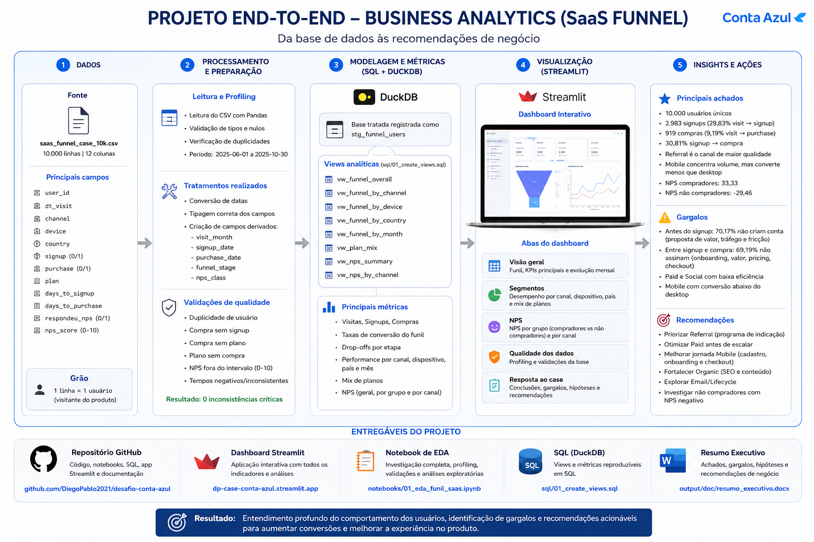

# Desafio Conta Azul - Business Analytics

Projeto analitico local para investigar o funil de conversao de um produto SaaS da Conta Azul, partindo de uma base CSV com 10.000 usuarios visitantes.

O objetivo e entender o comportamento dos usuarios, identificar gargalos no funil, aplicar raciocinio analitico com validacoes e transformar os achados em recomendacoes de negocio.

Repositorio GitHub:

```text
https://github.com/DiegoPablo2021/desafio-conta-azul
```

## Stack

- Python
- Pandas
- DuckDB
- Plotly
- Streamlit
- Jupyter Notebook
- python-docx

## Escopo Analitico

O funil analisado possui tres etapas principais:

1. Visita ao site/app
2. Signup
3. Purchase

A solucao cobre:

- leitura e profiling do CSV original;
- validacoes de qualidade dos dados;
- metricas de funil geral e segmentado;
- analise por canal, dispositivo, pais, mes e plano;
- analise de NPS geral, por canal e por compradores vs nao compradores;
- dashboard executivo em Streamlit;
- consultas SQL reproduziveis com DuckDB;
- notebook de investigacao analitica;
- resumo executivo em Word.

## Principais Resultados

| Metrica | Valor |
|---|---:|
| Visitas | 10.000 |
| Signups | 2.983 |
| Compras | 919 |
| Visit to signup | 29,83% |
| Visit to purchase | 9,19% |
| Signup to purchase | 30,81% |
| Respostas NPS | 1.206 |
| NPS medio | 8,11 |

Principais leituras:

- O maior gargalo ocorre antes do signup: 70,17% dos visitantes nao criam conta.
- A perda pos-signup tambem e relevante: 69,19% dos signups nao viram compra.
- `referral` e o canal de maior eficiencia, com 18,23% de visit to purchase.
- `organic` combina volume e boa conversao.
- `paid` e `social` apresentam baixa eficiencia de compra.
- `mobile` concentra volume, mas converte menos que `desktop`.
- Compradores apresentam NPS estimado positivo, enquanto nao compradores apresentam NPS estimado negativo.

## Arquitetura



O fluxograma acima resume o caminho da solucao: o CSV original e carregado e tratado com Pandas, as metricas sao modeladas em SQL com DuckDB, o notebook documenta a investigacao analitica, o Streamlit apresenta o dashboard executivo e os scripts geram documentos Word localmente.

```text
CSV original
  -> Pandas: carga, profiling, tipagem, campos derivados e validacoes
  -> DuckDB: staging em memoria e views analiticas em SQL
  -> Notebook: investigacao, raciocinio analitico e graficos Plotly
  -> Streamlit: dashboard executivo interativo
  -> Word: resumo executivo e materiais de apoio gerados por script
```

## Estrutura do Projeto

```text
desafio-conta-azul/
  app.py
  requirements.txt
  README.md
  saas_funnel_case_10k_refresh_(4)_(2).csv
  .streamlit/
    config.toml
  docs/
    assets/
      image-end-to-end.png
      arquitetura_pipeline_dados.png
    documentacao_tecnica_funcional.md
    guia_celulas_notebook.md
    resumo_executivo.md
  output/
    doc/
      resumo_executivo_conta_azul.docx
  notebooks/
    01_eda_funil_saas.ipynb
  scripts/
    export_summary_docx.py
    export_presentation_script_docx.py
    export_notebook_guide_docx.py
  sql/
    01_create_views.sql
    02_funnel_analysis.sql
    03_nps_analysis.sql
  src/
    __init__.py
    config.py
    data_pipeline.py
    metrics.py
```

## Instalacao

No Windows, use o Python Launcher para garantir o Python 3.13:

```powershell
py -3.13 -m pip install -r requirements.txt
```

Se o comando `pip install -r requirements.txt` chamar outro Python sem `pip`, use sempre o formato com `py -3.13 -m pip`.

## Como Executar

Dashboard Streamlit:

```powershell
py -3.13 -m streamlit run app.py
```

Gerar resumo executivo em Word:

```powershell
py -3.13 scripts\export_summary_docx.py
```

Gerar roteiro de apresentacao em Word:

```powershell
py -3.13 scripts\export_presentation_script_docx.py
```

Gerar guia do notebook em Word:

```powershell
py -3.13 scripts\export_notebook_guide_docx.py
```

Validacao sintatica dos arquivos Python:

```powershell
py -3.13 -m compileall app.py src scripts
```

## Deploy

O app esta preparado para deploy no Streamlit Community Cloud a partir do GitHub.

Configuracao:

```text
Repository: DiegoPablo2021/desafio-conta-azul
Branch: main
Main file path: app.py
Python version: 3.12 ou superior
```

O Streamlit Cloud executa o app a partir da raiz do repositorio e instala as dependencias declaradas em `requirements.txt`.

## Notebook

O notebook principal fica em:

```text
notebooks/01_eda_funil_saas.ipynb
```

Ele demonstra:

- leitura do CSV com Pandas;
- profiling da base;
- validacoes de qualidade;
- tratamento e campos derivados;
- criacao de views DuckDB;
- funil geral;
- analise por canal, dispositivo, pais e mes;
- analise de NPS;
- graficos com Plotly;
- principais conclusoes antes do dashboard.

No VS Code, abra o arquivo como Jupyter Notebook e selecione o kernel Python 3.13. Se o arquivo abrir como JSON, use:

```text
Open With... > Jupyter Notebook
```

## Dashboard Streamlit

O dashboard possui cinco abas:

- `Visao geral`: KPIs do funil, grafico de funil e evolucao mensal.
- `Segmentos`: performance por canal, dispositivo, pais, plano e matriz canal x dispositivo.
- `NPS`: NPS geral, compradores vs nao compradores e NPS por canal.
- `Qualidade dos dados`: profiling e validacoes da base.
- `Resposta ao case`: conexao direta entre achados, raciocinio analitico e recomendacoes.

Os filtros laterais permitem recortar a analise por:

- mes da visita;
- canal;
- dispositivo;
- pais.

## Camada SQL

As views DuckDB ficam em:

```text
sql/01_create_views.sql
```

Views criadas:

- `vw_funnel_overall`
- `vw_funnel_by_channel`
- `vw_funnel_by_device`
- `vw_funnel_by_country`
- `vw_funnel_by_month`
- `vw_plan_mix`
- `vw_channel_device`
- `vw_nps_summary`
- `vw_nps_by_channel`

Consultas complementares:

- `sql/02_funnel_analysis.sql`
- `sql/03_nps_analysis.sql`

## Qualidade dos Dados

As validacoes ficam em `src/data_pipeline.py` e cobrem:

- unicidade de usuario;
- datas invalidas;
- compra sem signup;
- compra sem plano;
- plano sem compra;
- dias de conversao inconsistentes;
- NPS preenchido sem resposta;
- NPS fora do intervalo esperado;
- categorias inesperadas em canal, dispositivo, pais e plano.

Na base completa, as regras criticas do funil nao apresentaram inconsistencias.

## Documentacao

Documentos em Markdown:

- `docs/documentacao_tecnica_funcional.md`: documentacao tecnica e funcional completa.
- `docs/resumo_executivo.md`: versao Markdown do resumo executivo.
- `docs/guia_celulas_notebook.md`: guia celula a celula do notebook.

O resumo executivo tambem esta disponivel em Word:

- `output/doc/resumo_executivo_conta_azul.docx`

Os demais documentos Word podem ser gerados localmente pelos scripts em `output/doc/`, mas sao tratados como saidas de apoio e nao precisam ficar versionados no repositorio.

Arquivos `.docx` devem ser abertos no Microsoft Word ou aplicativo equivalente. Ao abrir um `.docx` como texto no VS Code, o conteudo aparece como binario ilegivel.

## Observacao Metodologica

Embora a Conta Azul utilize Looker, esta solucao usa Streamlit para permitir execucao local e reproduzivel. As metricas foram implementadas em SQL com DuckDB e documentadas de forma agnostica, permitindo migracao futura para Looker, Power BI ou outra camada semantica.
